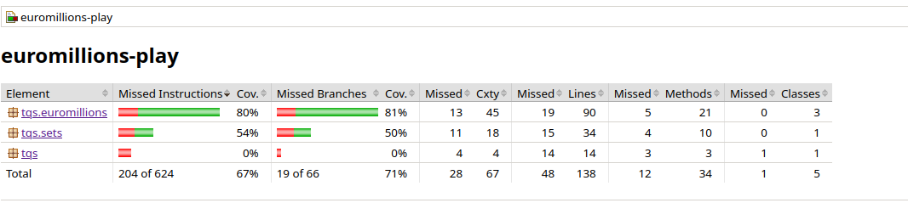
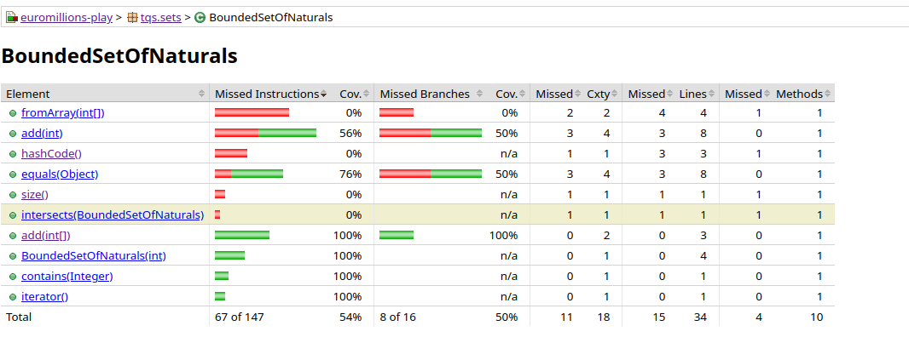
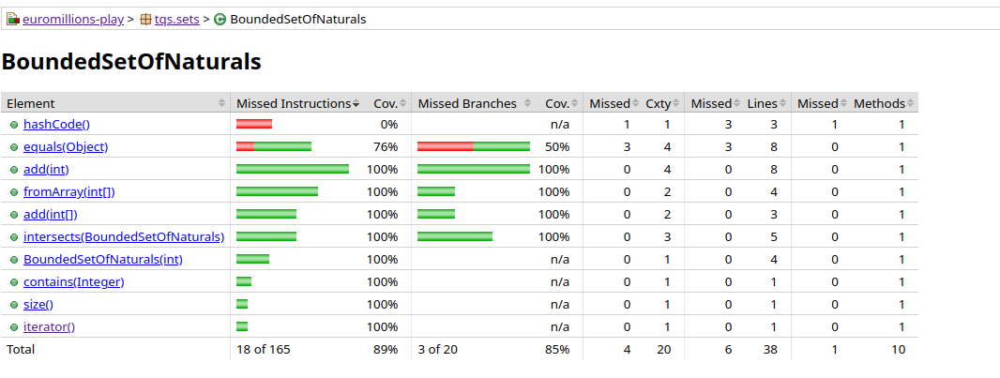

# Lab01 notes
## Ex01
### 1g

Even with a high code coverage level, there might be some fails in certain cases, such as:

-  **Concurrency Issues**
   - If TqsStack were used in a multi-threaded environment, race conditions could occur when multiple threads access or modify the stack simultaneously. Since no synchronization mechanisms are implemented, concurrent operations could lead to data corruption.

- **Performance Considerations**
   - The `popTopN(int n)` method iterates `n` times, leading to a worst-case time complexity of **O(n)**. If `n` is large, this could impact performance. 
   - A more efficient approach might involve batch operations or restructuring the internal storage.

- **Hidden Bugs Not Triggered by Tests**
   - High test coverage only guarantees that each line of code is executed at least once. However, it does not guarantee correctness in all situations.
   

- **Reliability of Code Coverage for Quality Assessment**
   - Code coverage is a useful metric but should not be the sole indicator of software quality. High coverage does not mean that the code is free from defects, nor does it ensure robustness.
   - A combination of **unit tests, integration tests, stress tests, and real-world scenarios** should be used to achieve a comprehensive quality assessment.

**Conclusion**
While achieving 100% method and statement coverage is beneficial, it does not eliminate the possibility of failure in real-world use cases. Proper test design, including edge cases, performance considerations, and concurrency handling, is essential for ensuring the robustness of the TqsStack implementation.

## Ex02
### 2c
In the default tests, many classes were uncovered, such as DemoMain. Not every possible branch is being tested.

Foccusing on BoundedSetOfNaturals, there should be tests for the following methods:
- `intersects`
- `fromArray`
- `add` : more coverage on the different cases

After adding tests for the above methods, the coverage is higher. The only methods that are not fully tested are the equals and hashcode, both generated.

