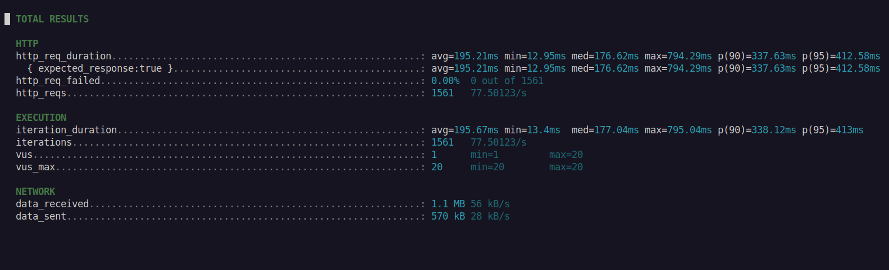
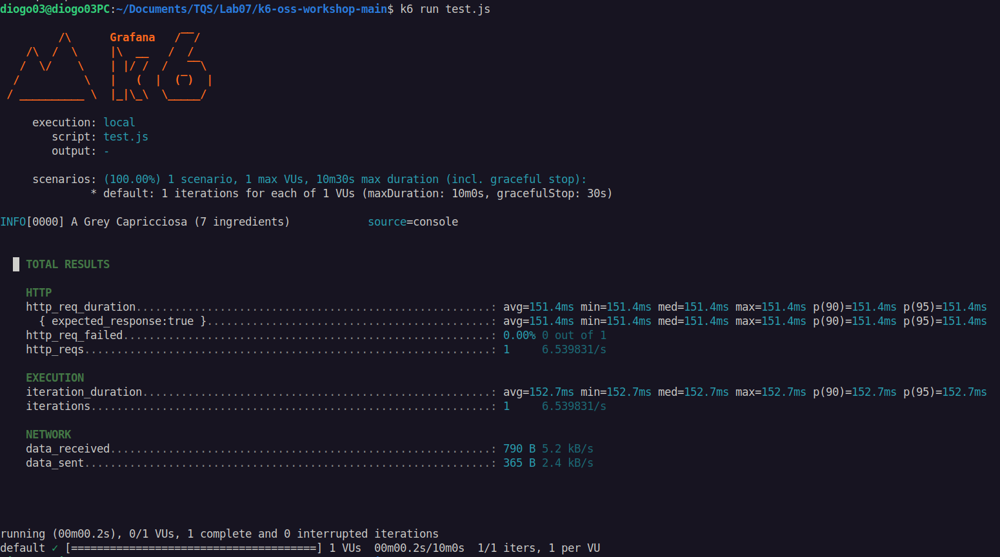
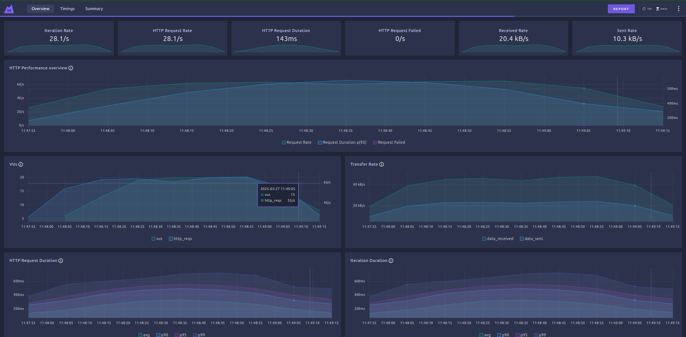
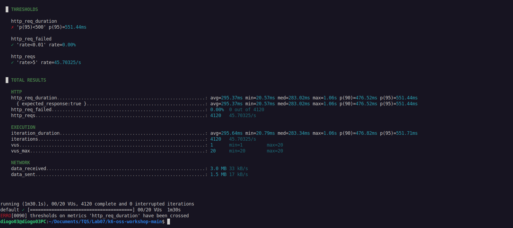
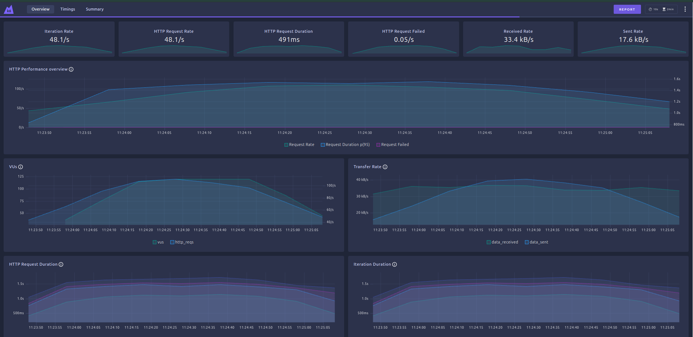
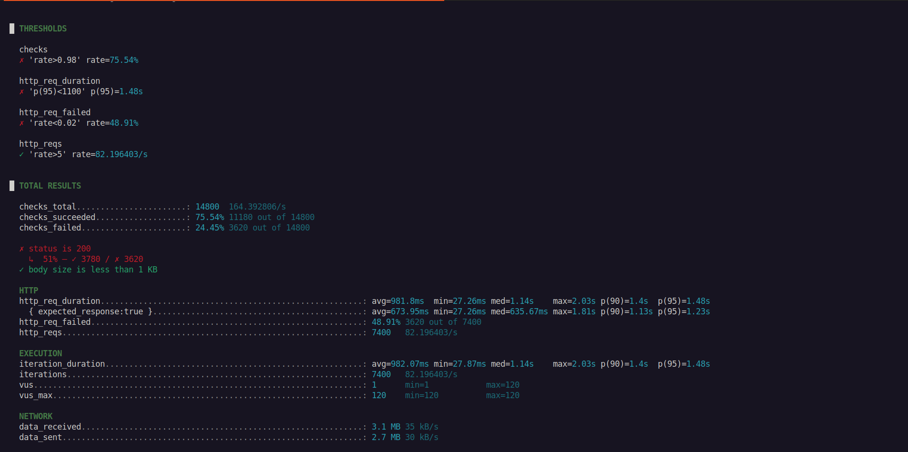
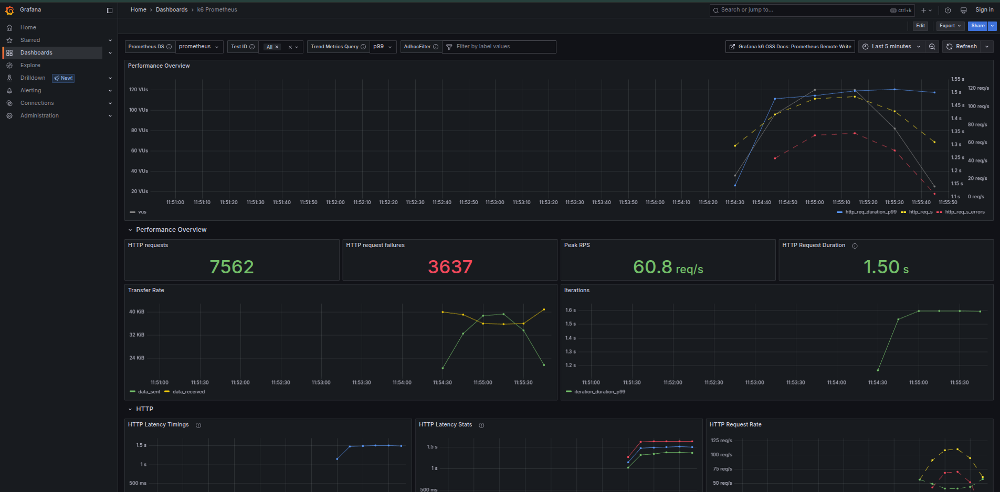

# Non-Functional Performance Testing Report

## Introduction

Non-functional testing is a critical aspect of software quality assurance that goes beyond traditional functional testing by evaluating the system's performance, reliability, and overall quality attributes. In this lab, we conducted a comprehensive performance testing exercise using advanced tools like k6 for load testing and Lighthouse for frontend performance and accessibility analysis.

The primary objectives of this non-functional testing were to:

- Assess the system's performance under various load conditions
- Verify Service Level Objectives (SLOs)
- Evaluate the web application's efficiency and responsiveness
- Analyze frontend performance metrics
- Examine accessibility and best practices implementation

Our testing methodology involved multiple stages:

1. Load testing of the QuickPizza website's API using k6
2. Implementing different load scenarios with varying virtual user (VU) counts
3. Establishing and monitoring performance thresholds
4. Conducting a comprehensive frontend audit using Lighthouse

Through these tests, we aimed to gain insights into the system's behavior under different stress conditions and identify potential performance bottlenecks, ultimately contributing to a more robust and user-friendly web application.

## Exercise 1

**API Call Duration**:
- Average: 195.21 ms
- Minimum: 12.95 ms
- Maximum: 794.29 ms

**Number of Requests**:
- Total Requests: 1,561

**Request Failures**:
- Failed Requests: 0 (0%)
- All requests returned HTTP status code 200
- - -
## Exercise 2
Load test scenarios using k6 with a predefined traffic evolution pattern, allowing us to simulate and analyze the system's performance under varying load conditions.

### 2a: Ramp up from 0 to 20 virtual users (VUs) over 5 seconds, maintain 20 VUs for 10 seconds, and then ramp down to 0 VUs over the next 5 seconds

**API Call Duration**:
- Average: 151.4 ms
- Minimum: 151.4 ms
- Maximum: 151.4 ms

**Number of Requests**:
- Total Requests: 1

**Request Failures**:
- Failed Requests: 0 (0%)
- All requests returned HTTP status code 200
- - -

###  2b and 2c: Advanced Load Test Scenario with Thresholds

#### Test Configuration
In these exercises, we implemented a more comprehensive load test scenario with the following characteristics:
- Ramp-up phase: 0 to 20 VUs over 30 seconds
- Sustained load: 20 VUs for 30 seconds
- Ramp-down phase: 20 to 0 VUs over 30 seconds

#### Performance Metrics

**API Call Duration**:
- Average: 295.37 ms
- Minimum: 20.57 ms
- Maximum: 1.06 s
- 95th Percentile: 551.44 ms

**Number of Requests**:
- Total Requests: 4,120
- Request Rate: 45.70325/s

**Request Failures**:
- Failed Requests: 0 (0%)
- All requests returned HTTP status code 200

#### Threshold Criteria
The test was configured with specific thresholds:
- 95th percentile response time < 500 ms
- Failed request rate < 1%
- Request rate > 5/s
- - - 

### 2d and 2e: 120 VUs

**API Call Duration**:
- Average: 981.8 ms
- Minimum: 27.26 ms
- Maximum: 2.06 s
- 95th Percentile: 1.48 s

**Number of Requests**:
- Total Requests: 7400
- Request Rate: 82.196403 /s

**Request Failures**:
- Failed Requests: 3,620 out of 14,800 total checks
- Failure Rate: 24.45% of checks failed

***Observations***
When increasing the load from 20 to 120 Virtual Users (VUs), the system experienced significant performance challenges:

-The average request duration increased dramatically from the previous test
-A substantial portion of checks failed (nearly 25%)
-The maximum request duration stretched to 2.03 seconds
-The system struggled to maintain consistent performance under high load

The results indicate that the application's performance degrades significantly under increased user load, suggesting potential scalability issues that would need further investigation and optimization.
- - - 
### 2f

**API Call Duration**:
- Average:1.5 s
- Peak: > 1.5 s
- Maximum: ~ 2 s

**Number of Requests**:
- Total Requests: 7562
- Request Rate: 60.8 /s

**Request Failures**:
- Failed Requests: 33637 out of 7562 total checks
- Failure Rate: 48.1% of checks failed
