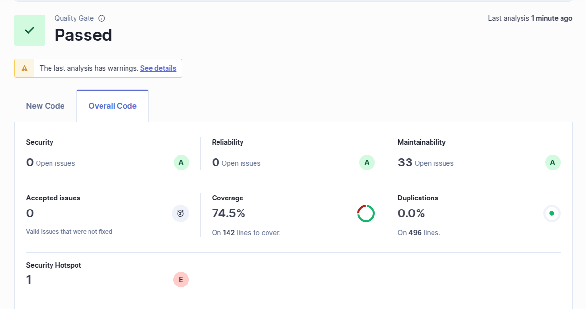
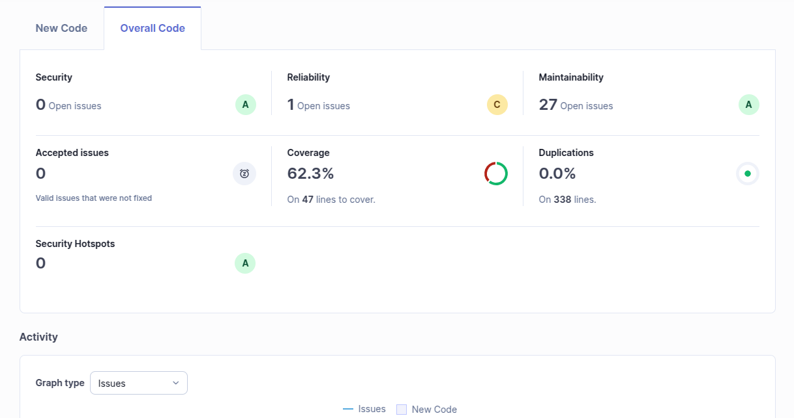
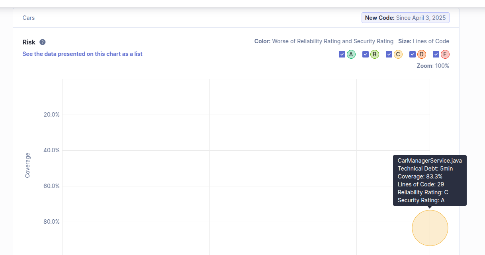
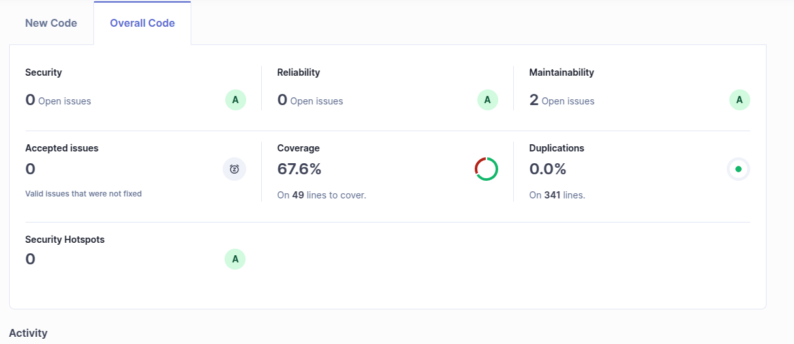

# Lab08: Clean code and static analysis

## Ex01

```
Quality Gate: Passed ✅

Security: 0 Open Issues (Grade: A)
Reliability: 0 Open Issues (Grade: A)
Maintainability: 33 Open Issues (Grade: A)
Accepted Issues: 0
Coverage: 74.5% (142 lines to cover)
Duplications: 0.0% (496 lines analyzed)
Security Hotspot: 1 (Grade: E)
```

### Quality Gate Status

The project has successfully passed the defined quality gate. This means that the overall quality of the code meets the required standards, with high scores in security, reliability, and maintainability. However, some maintainability issues (33 open issues) and one security hotspot need further investigation. 

### Sample Issues Identified

| Issue Type          | Problem Description                                      | Suggested Solution                             |
|--------------------|--------------------------------------------------|------------------------------------|
| **Security**        | 1 security hotspot detected.                     | Review and mitigate if necessary. |
| **Reliability**     | No issues found.                                 | -                                  |
| **Maintainability** | 33 open maintainability issues.                  | Review code structure and refactor where needed. |
| **Security Hotspot** | Potential security risk identified.              | Investigate and follow best security practices. |

### External Tools in Sonar Configuration

SonarQube may integrate with various external tools for static code analysis, dependency checks, and security auditing. Some commonly referenced tools include:
- **Checkstyle** (for Java code style checks)
- **PMD** (for detecting code quality issues)
- **FindBugs/SpotBugs** (for detecting potential bugs)
- - -
## Ex02
### Before:



### After:



### **Discussion**
- **Current overall coverage:** **67.6%**  
- **Total lines to cover:** **49**  
- **Uncovered lines:**  
  - `Uncovered Lines = 49 - (67.6% * 49)`  
  - `Uncovered Lines = 49 - 33.1`  
  - `Uncovered Lines ≈ 16`
- **Previous coverage:** **62.3%**  
- **Improvement:** **Coverage increased by 5.3%**  
- **Duplication:** **0.0%** (No duplicated code, which is optimal)  
- **Are the values good?**  
  - The improvement in code coverage is positive.  
  - **67.6% is better than before but should aim for at least 80%** for better testing reliability.  
  - **No security issues, no reliability issues**, which is excellent.  


